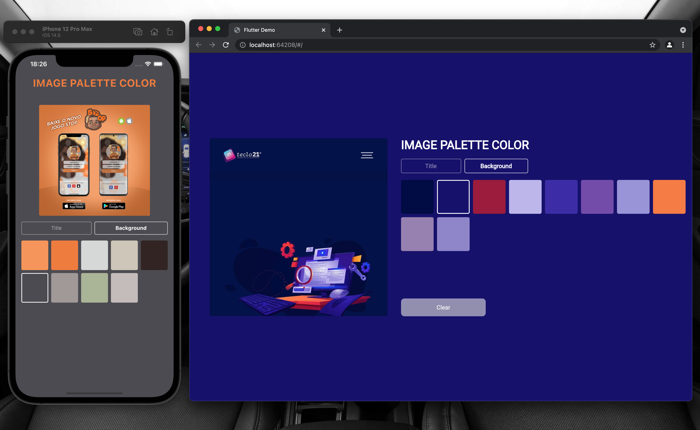

# image_get_color_palette 

## Install Flutter

### Step One
To install flutter follow the directions below as per the different OS.

#### Windows
1. Official link at [Docs](https://flutter.dev/docs/get-started/install/windows)
2. Download [Bundle](https://storage.googleapis.com/flutter_infra/releases/stable/windows/flutter_windows_v1.9.1+hotfix.2-stable.zip)
3. Extract the zip file and place the contained flutter in the desired installation location for the Flutter SDK (for example, C:\src\flutter; do not install Flutter in a directory like C:\Program Files\ that requires elevated privileges.
4. Append flutter/bin to environment variables.
5. Run flutter doctor.
```
flutter doctor
```

#### MacOS
1. Official link at [Docs](https://flutter.dev/docs/get-started/install/macos)
2. Download [Bundle](https://storage.googleapis.com/flutter_infra/releases/stable/macos/flutter_macos_v1.9.1+hotfix.2-stable.zip)
3. Extract the file in the desired location, i.e,
``` 
unzip ~/Downloads/flutter_macos_1.22.6-stable.zip
```
4. Add flutter tool to your path, i.e,
```        
export PATH="$PATH:`pwd`/flutter/bin"
```
5. Run flutter doctor.
```        
flutter doctor
```

#### Linux
1. Offical link at [Docs](https://flutter.dev/docs/get-started/install/linux)
2. Download [Bundle](https://storage.googleapis.com/flutter_infra/releases/stable/linux/flutter_linux_v1.9.1+hotfix.2-stable.tar.xz)
3. Extract the file to the desired location, i.e,
```        
tar xf ~/Downloads/flutter_linux_1.22.6-stable.tar.xz
```
4. Add flutter tool to your path, i.e,
```        
export PATH="$PATH:`pwd`/flutter/bin"
```
5. Run flutter doctor.
```
flutter doctor
```    

***
## Set up an editor

1. You can use the editor of your choice, but the most common are,
    1. [Android Studio](https://developer.android.com/studio)
    2. [IntelliJ IDEA Community](https://www.jetbrains.com/idea/download/)
    3. [IntelliJ IDEA Ultimate (Paid)](https://www.jetbrains.com/idea/download/)
    4. [Visual Studio Code](https://code.visualstudio.com/)

2. Install Flutter and Dart plugins.

***
## Getting Started 🚀

<p float="left;padding=10px">
 
</p>

- Dependencies 
  * palette_generator: ^0.3.1
  * mobx: ^2.0.1
  * flutter_mobx: ^2.0.0
  * image_picker: ^0.8.4
  * customized:
    
- Clone the repo
   ``` 
   https://github.com/EdvaldoMartins/image_get_color_palette.git
   ```
- Install the dependicies
- Run the command on the terminal
  ``` 
   flutter packages pub run build_runner build --delete-conflicting-outputs
   ```
- Run it
 

 
    
    
 

